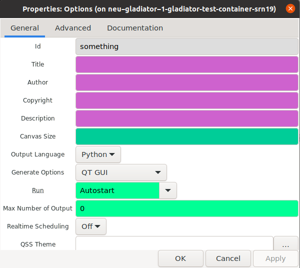
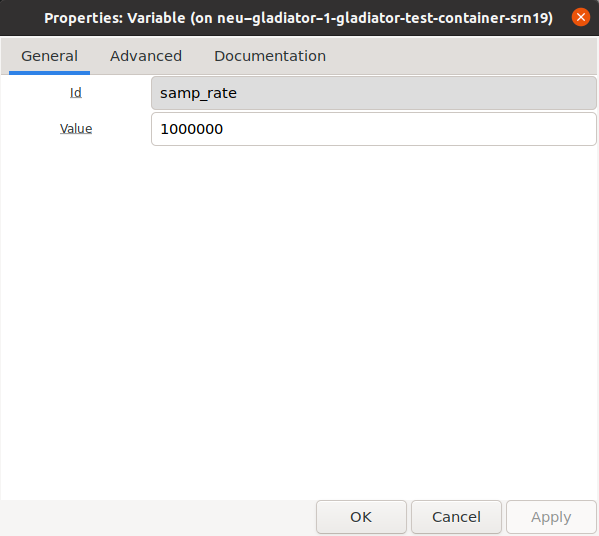
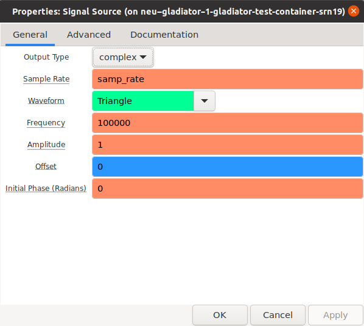
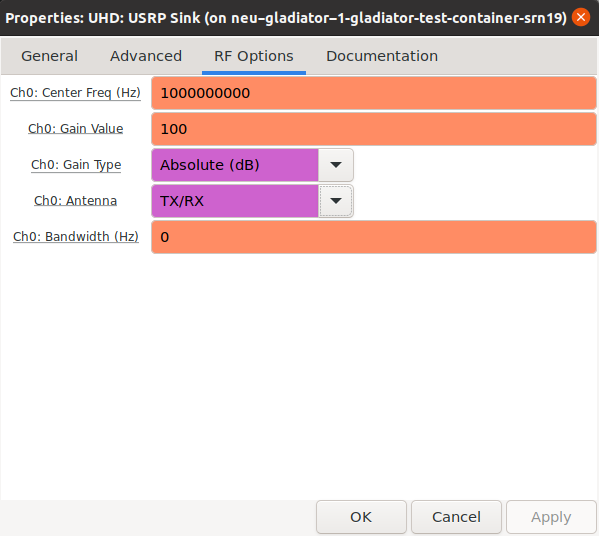
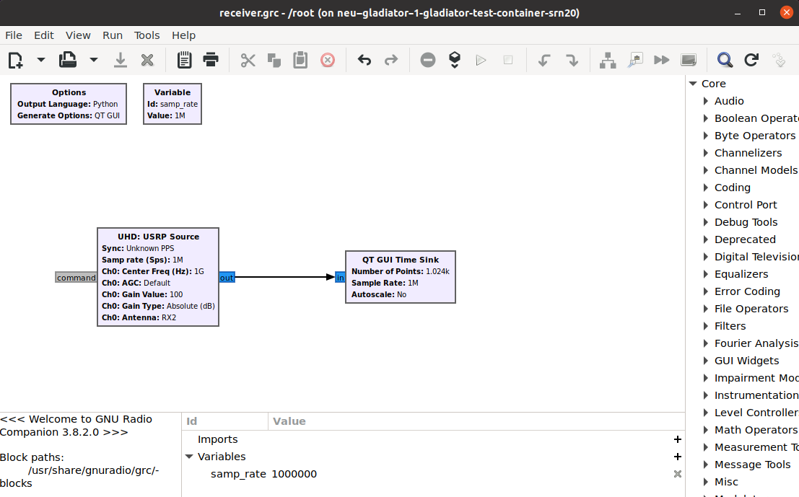
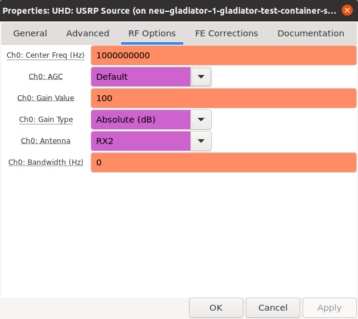
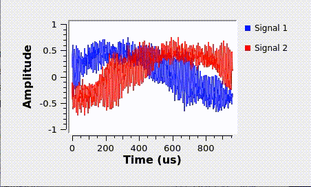

# Custom Container Assignment

In this assignment, we will first customize a container by adding a GUI for [gnuradio](https://www.gnuradio.org/), then we will use this container to stream samples from a USRP device, acting as a transmitter to another USRP device, acting as a receiver. 


## Pre-requisites

- Students have set up their ssh keys ([Upload SSH Public Keys](https://colosseumneu.freshdesk.com/en/support/solutions/articles/61000253402-upload-ssh-public-keys)) and ssh proxy ([SSH Proxy Setup](https://colosseumneu.freshdesk.com/en/support/solutions/articles/61000253369-ssh-proxy-setup)).
- Students are able to successfully access to Colosseum resources ([Accessing Colosseum Resources](https://colosseumneu.freshdesk.com/en/support/solutions/articles/61000253362-accessing-colosseum-resources)), e.g., log in to the SSH gateway and file-proxy servers.
- Students are assigned to the Colosseum team “_gladiators_”.
- A Linux environment (E.g., ubuntu) with LXC installed (it should have been done as a class pre-requisite).


## Container Customization

1. In a Linux environment **open a terminal**, and use the following command to transfer the base image from the File Proxy server to a local folder: `rsync -vP -e ssh file-proxy:/share/nas/gladiators/images/base-2104.tar.gz ./` <br />This will establish a communication over the network and download a container archived image.

2. Ensure you have the following lines in the files `/etc/subuid` and `/etc/subgid`
    ```
    lxd:100000:65536
    root:100000:65536
    ```
   - By using the following command you can open the files and edit them if they are missing the above lines: `sudo gedit /etc/subuid /etc/subgid`
   - This step ensures your user has the required privileges to use lxc.
   - Ensure the LXD service is running: `sudo systemctl start lxd`

3. Import the archived image in lxc: `lxc image import base-2104.tar.gz --alias base` <br /> The archived images cannot be readily used by lxc, and they need to be loaded in the system. You can check the available loaded images typing: `lxc image list`

4. Initialize and launch the container:
    ```
    lxc init local:base my-cont
    lxc start my-cont
    ```
    Containers are **“running instances of images”**. They share all the contents in terms of files and folders of an image, but they can also be modified and their executables can be run. By starting _my-cont_ from the _base_ image we can prepare our software starting from base-1604-nocuda (avoiding to start from scratch) and later commit it in another image which can be treated as an immutable snapshot of the container. (Hence, granting eventually the repeatability of the Colosseum experiments).

5. You can now log in in the running container with: `lxc exec my-cont /bin/bash` <br /> The above command launches a process (the bash command shell) inside the container _my-cont_. You could launch any program already present in the container, but to see the command line output you need a shell first.

6. To customize the container, you can start by choosing a new password typing the following command in the container shell: `passwd` <br /> This will be important later on, when you start your reservation on Colosseum and you are prompted with the password for the container.

7. The process of installing mainstream software is the same of any Ubuntu machine, using the command `apt`. For this assignment, install the gnuradio-companion package:
    ```
    apt update
    apt install gnuradio gir1.2-gtk-3.0
    ```
    This will install Gnuradio-companion, which is a Graphical User Interface (GUI) for [gnuradio](https://www.gnuradio.org/) and allows the visual composition of signal processing chains. It can readily be used for experiments on Colosseum.

8. We are ready to commit our changes and stop the container:
    ```
    exit
    lxc stop my-cont
    lxc publish my-cont --alias my_image
    lxc image list
    ```
   Stopping the container terminates the processes running from its executables and editing its files; it is an important step for avoiding data inconsistency while publishing (committing) the changes.<br /> The publishing takes a snapshot of the container and saves it in a new image.

9. Export the updated image in an archive: `lxc image export my_image <insert_your_surname>` <br /> To handle and transfer an image we first need to export it in an archived image.

10. Upload your newly archived image to Colosseum servers:
`rsync -vP -e ssh <your_surname>.tar.gz file-proxy:/share/nas/gladiators/images/` <br /> Colosseum presents to its users the available containers image present in the related group folder. By transferring the archived image in the folder indicated above you are making it available to all users in your group for starting a Colosseum reservation and experiment.


## Experimenting with the new container

1. Login to [Colosseum website](https://experiments.colosseum.net).

2. Make a reservation with the **<your_surname>** image for two SRNs (see instructions on [Making a Reservation](https://colosseumneu.freshdesk.com/en/support/solutions/articles/61000253463-making-a-reservation-interactive-and-batch-mode-)). Call the reservation in a meaningful way (e.g., your name). Two hours should suffice.

3. In the reservation page, you can find the assigned SRNs/nodes and their hostnames by hovering over nodes. At your scheduled reservation time, **open two terminals** and ssh into the assigned Colosseum SRNs
(see instructions on [Logging into an SRN](https://colosseumneu.freshdesk.com/en/support/solutions/articles/61000253366-logging-into-an-srn)): `ssh -Y <srn-hostname>` <br />
   **Note 1**: You need to setup your ssh config files by following the instructions in SSH Proxy Setup (see the pre-requisites section for more information).<br />
   **Note 2**: The -Y flag allows the use of GUI applications.

4. In one of the terminals, run the following command to start a Colosseum Radio-frequency (RF) scenario through the Colosseum CLI API (see instructions [here](https://colosseumneu.freshdesk.com/en/support/solutions/articles/61000253397-colosseum-cli)): `colosseumcli rf start 1009 -c`. When the scenario starts, an output similar to the following is returned (time is in UTC):
    ```
    Scenario Start Time is 22:30:45
    ```
    This will engage the Colosseum RF Channel Emulator and make the necessary connections between the USRPs of the reserved nodes based on the parameters set in the specific RF scenario (see the [Scenario Summary List](https://colosseumneu.freshdesk.com/en/support/solutions/articles/61000276224-scenarios-summary-list)). In this assignment we will use the [Test Scenario All Paths 0 dB (1009)](https://colosseumneu.freshdesk.com/support/solutions/articles/61000277641-test-scenario-all-paths-0-db-1009). You can check if the RF scenario is active and running by executing the following command: `colosseumcli rf info`

5. Update the FPGA firmware `./flash_fpga_x310.sh` <br /> This step ensures the correct firmware is present in the Software Defined Radios by flashing its bitfile.

6. In both terminals, execute the following command to open the GUI (ignore any warnings that might pop up): `gnuradio-companion` <br /> We will use one node as transmitter and the other one as receiver.

7. In the transmitter GUI:
   1. Create the following graph with blocks: _Signal Source_, _Throttle_, and _UHD: USRP Sink_ (you can search for a block through the lent icon). <br /><br /> 
   2. Double-click on the _Options_ block to open the block settings and specify the _Id_ to “something”. <br /><br /> 
   3. Double-click on the _Variable_ block and specify a sampling rate Value of 1 MHz (1000000). <br /><br /> 
   4. Double-click on the _Signal Source_ and specify a Triangle waveform. <br /><br /> 
   5. Double-click on the _UHD: USRP Sink_ block and in the RF Options tab specify a central frequency of 1 GHz (1000000000) and a Channel Gain Value of 100. <br /><br /> 

8. In the receiver GUI:
   1. Create the following graph with blocks: _UHD: USRP Source_ and _QT GUI Time Sink_ (you can search for a block through the lent icon). <br /> 
   2. Double-click on the _Options_ block to open the block settings and specify the _Id_ to “something”. <br /><br /> 
   3. Double-click on the _Variable_ block and specify a sampling rate Value of 1 MHz (1000000). <br /><br />
   4. Double-click on the _USRP Source_ block and in the RF Options tab specify a central frequency of 1 GHz (1000000000) and a Channel Gain Value of 100. <br /><br /> 

9. To start a system, click on the execute button in the setting bar. You will be prompted to save the sketch somewhere before actually start the processing. Save them and start both the receiver and the transmitter. If everything goes as expected, the output should be similar to this. <br /><br /> 

10. To stop the systems, simply close the windows or click the stop button.

11. Optional: try to change the signal type and the transmission gain and notice any difference that might occur.


## Clean up

This concludes Colosseum Custom Container assignment. After you are done with your experiments, it is good practice to stop the RF scenario by running the following command from within one of the SRN containers and to terminate your reservation from the Colosseum portal:
- `colosseumcli tg stop`
- `colosseumcli rf stop`
- In all terminals, close your ssh connections by typing: `exit`
- Access the Colosseum portal and delete your reservation.
