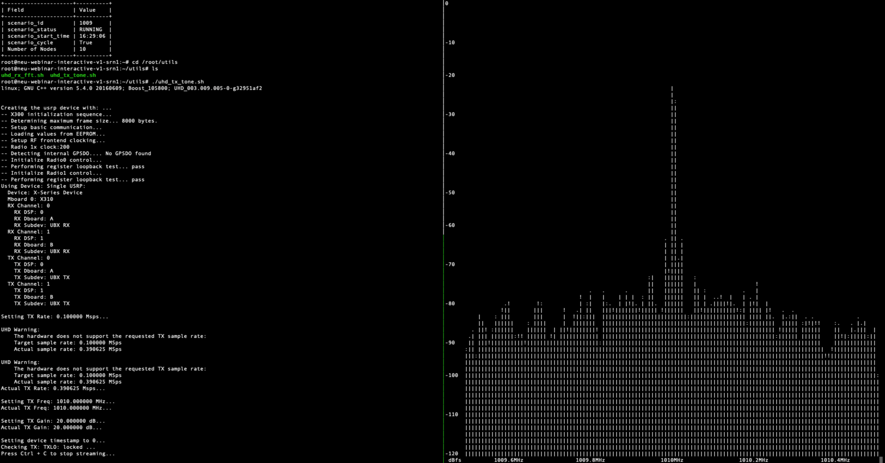
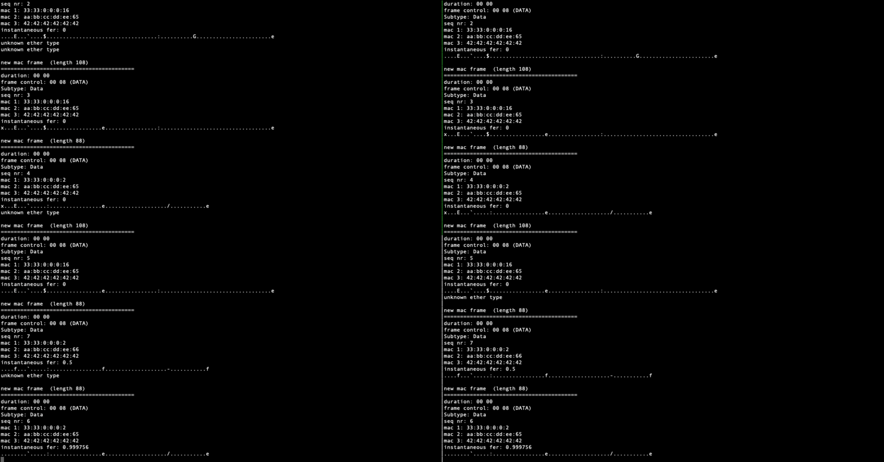

# Wi-Fi Assignment

In this assignment, we will use a GNU Radio [IEEE 802.11 a/g/p transceiver](https://github.com/bastibl/gr-ieee802-11) to instantiate a Wi-Fi-enabled ad hoc network on Colosseum and exchange traffic between the Wi-Fi nodes.


## Make a reservation on Colosseum

1. Connect to Colosseum VPN (instructions [here](https://colosseumneu.freshdesk.com/support/solutions/articles/61000285824-cisco-anyconnect-remote-vpn-access) and login to [Colosseum website](https://experiments.colosseum.net)).
2. Make a reservation with two SRNs with the `webinar-interactive-v1` image (see instructions on [Making a Reservation](https://colosseumneu.freshdesk.com/en/support/solutions/articles/61000253463-making-a-reservation-interactive-and-batch-mode-)).
Call the reservation in a meaningful way (e.g., your name). Two hours should suffice.
3. In the reservation page, you can find the assigned SRNs/nodes and their hostnames by hovering over nodes.
At your scheduled reservation time, open two terminals and ssh into the assigned Colosseum SRNs[^1]<sup>,</sup>[^2]
(see instructions on [Logging into an SRN](https://colosseumneu.freshdesk.com/en/support/solutions/articles/61000253366-logging-into-an-srn)): `ssh <srn-hostname>`
4. In one of the terminals, run the following command to start a Colosseum Radio-frequency (RF) scenario through the Colosseum CLI API (see instructions [here](https://colosseumneu.freshdesk.com/en/support/solutions/articles/61000253397-colosseum-cli)): `colosseumcli rf start 1009 -c`.
When the scenario starts, an output similar to the following is returned (time is in UTC):
  ```
  Scenario Start Time is 22:30:45
  ```
5. This will engage the Colosseum RF Channel Emulator and make the necessary connections between the USRPs of the reserved nodes based on the parameters set in the specific RF scenario (see the [Scenario Summary List](https://colosseumneu.freshdesk.com/en/support/solutions/articles/61000276224-scenarios-summary-list)).
In this assignment we will use the [Test Scenario All Paths 0 dB (1009)](https://colosseumneu.freshdesk.com/support/solutions/articles/61000277641-test-scenario-all-paths-0-db-1009).
You can check if the RF scenario is active and running by executing the following command: `colosseumcli rf info`.

[^1]: You need to setup your ssh config files by following the instructions in [SSH Proxy Setup](https://colosseumneu.freshdesk.com/en/support/solutions/articles/61000253369-ssh-proxy-setup).
[^2]: The password for the `webinar-interactive-v1` container is `sunflower`.


## Verifying the RF emulator is setup properly

In this step, we will verify that Colosseum RF emulator has been setup correctly.

1. In both terminals, cd to the `/root/utils` directory.
Execute the `uhd_tx_tone.sh` script in the first terminal, and the `uhd_rx_fft.sh` in the second one.
This will send a tone at a set frequency (1.01 GHz in this example) from the first SRN and it will display a spectrum analyzer in the second SRN.
If the RF emulator is set appropriately as explained in the previous section, the signal generated by the first SRN (left terminal in the figure below) will propagate through Colosseum RF emulator and reach the second SRN (right terminal).
The results should look similar to: <br /><br /> 

2. Hit `Ctrl+C` in both terminals to stop the `uhd_tx_tone.sh` and `uhd_rx_fft.sh` example scripts.
3. Optional: edit `uhd_tx_tone.sh` file to change the center frequency to 0.99 GHz.
4. Optional: edit `uhd_tx_tone.sh` file to change the center frequency to 0.9 GHz.
Repeat Step 1 and compare the results.


## Start the Wi-Fi nodes

1. For each SRN, cd to the `/root/interactive-scripts` directory and execute the `tap_setup.sh` script to setup a tap interface for the SRN (see [Traffic Generation](https://colosseumneu.freshdesk.com/en/support/solutions/articles/61000253508-traffic-generation) for more information on routing traffic in Colosseum): `/root/interactive_scripts/tap_setup.sh`
2. For each SRN, execute the `route_setup.sh` file (located in the `/root/interactive-scripts` directory) to setup the routing tables: `/root/interactive_scripts/route_setup.sh <ID of the other SRN>`.
In each of the SRN, you need to setup the route to the other SRN. The SRN IDs are created by adding 100 to the SRN number assigned to your reservation. As an example, SRN-015 will have ID 115, hence the `tr0` IP address of this node will be 192.168.115.1. In this example, the above command becomes: `/root/interactive_scripts/route_setup.sh 115`.
3. In each SRN, execute the `modem_start.sh` script to start the Wi-Fi modem: `/root/interactive_scripts/modem_start.sh`.
If the interfaces and routes are setup correctly, the results should look similar to:  <br /><br /> 

4. Now, open two new terminals and ssh into the same SRNs as before (this is to keep the other terminals with the modem running).
From each SRN, in the newly opened terminals, ping the `tr0` interface of the other SRN: `ping 192.168.<other-srn-ID>.1`.
This transmits ICMP packets over the RF emulator.
If the ping is successful, it means that you have configured your SRNs in the correct way and you have an emulated channel between them.
5. Hit `Ctrl+C` to stop the ping in both SRNs.


## Start Colosseum Traffic Generator (TGEN)

1. In one of the terminals, execute the following command to start a traffic scenario: `colosseumcli tg start 10090`
2. This will engage the Colosseum [Traffic Generator (TGEN)](https://colosseumneu.freshdesk.com/en/support/solutions/articles/61000253508-traffic-generation) and start packet flows between Colosseum and the SRNs of your reservation based on the parameters specified in the traffic scenario (see [Scenarios Summary List](https://colosseumneu.freshdesk.com/en/support/solutions/articles/61000276224-scenarios-summary-list)). You can check if the traffic scenario is active (and running) by executing the following command: `colosseumcli tg info`
3. Now you can monitor the packet flow on the `tr0` interface of each SRN by running the following command on each of them: `tcpdump -i tr0`.
Note that it takes a few minutes (~5 mins) for TGEN to initialize the traffic scenario and start transmitting packets to the SRNs.
In the container used in this assignment, a correctly-configured SRN will forward the packets to the other SRN through the RF channel emulator.
A bidirectional transmit/receive flow of packets can be seen in the output of the above tcpdump command:  <br /><br /> 

4. Hit `Ctrl+C` in all four terminals to stop the Wi-Fi applications and the tcpdump.


## Clean up

This concludes Colosseum Wi-Fi assignment. After you are done with your experiments, it is good practice to stop the traffic and RF scenarios by running the following command from within one of the SRN containers and to terminate your reservation from the Colosseum portal:
- `colosseumcli tg stop`
- `colosseumcli rf stop`
- In all terminals, close your ssh connections by typing: `exit`
- Access the Colosseum portal and delete your reservation.
